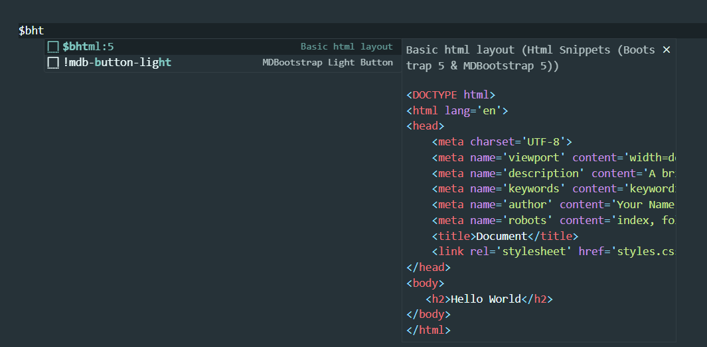

# Html snippets Extension

## Introduction
This is a VS Code extension that helps developers with basic html code fast write and help of write a bootstrap 5 codes and MDbootstrap 5 code.Using this extension you will be able to very easy code in HTML, Bootstrap and Mbootstrap.

## Features
- Feature 1: In Basic HTML you can create the basic structure of HTML ,table,form,list and basic html attributes.
- Feature 2: Bootstrap 5 like starter html structure ,navbar,tables,forms,buttons,budges,alert etc.
- Feature 2: MDBootstrap 5 like starter html structure ,navbar,tables,forms,buttons,budges,alert etc .

## New features added
- some html tags with class ,id and other attributes
- fix bugs

## Screenshots

## How to Use
- Open VS Code.
- Install and Activate the extension.
- To use HTML, type $bhtml,for table $btable ,for form $bform ,for button $bbutton and etc.
- bootstrap 5 $bs5,$bstable,$bsform etc. and for mdbbootstrap 5 $mdb5,$mdtable,$mdbform etc.
- Enjoy the features.

## Release Notes
### v0.0.7
* fix bugs
* improve code
### v0.0.6
- Initial release with core features.

