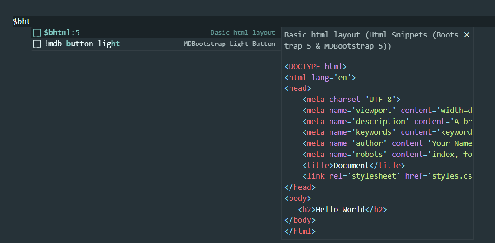

# Html snippets Extension

## Introduction
This is a VS Code extension that helps developers with basic html code fast write and help of write a bootstrap 5 codes and MDbootstrap 5 code.

## Features
- Feature 1: Basic html like create structure, table,button,form,image etc.
- Feature 2: Bootstrap 5 like starter html structure ,navbar,tables,forms,buttons,budges,alert etc.
- Feature 2: MDBootstrap 5 like starter html structure ,navbar,tables,forms,buttons,budges,alert etc .

## New features added
- some html tags with class ,id and other attributes
- fix bugs

## Screenshots

## How to Use
- Open VS Code.
- Activate the extension using for html $bhtml,$btable etc.
- bootstrap 5 $bs5,$bstable,$bsform etc. and for mdbbootstrap 5 $mdb5,$mdtable,$mdbform etc.
- Enjoy the features.

## Release Notes
### v0.0.4
- Initial release with core features.

